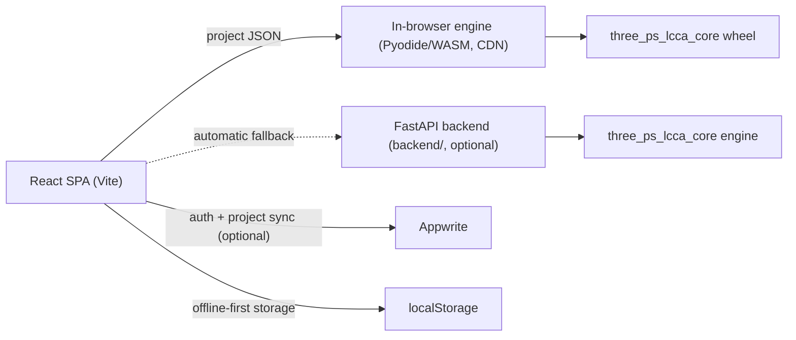

# 3psLCCA Web

Web interface for **Life Cycle Cost Analysis (LCCA) of bridge projects** — the
browser counterpart of the 3psLCCA desktop application, built with React and
Vite.

Users enter bridge, traffic, financial, construction, carbon-emission,
maintenance, recycling, and demolition data page by page (mirroring the
desktop app's schema), run the analysis through the
[`3psLCCA-core`](https://github.com/3psLCCA/3psLCCA-core) Python engine, and
get interactive charts, cost-breakdown tables, and a downloadable PDF report.

## Architecture



- **Calculations run in the browser** by default: the app loads the official
  [3psLCCA-core browser engine](https://3pslcca.github.io/3psLCCA-core/)
  (Pyodide + the versioned `three_ps_lcca_core` wheel) from the CDN,
  integrity-pinned to the published release hash, and feeds it through the
  same web→core adapter the backend uses. No server is required.
- **The FastAPI backend is an optional fallback**: if the CDN engine cannot
  load (offline, CDN outage), the app switches to it automatically — see
  [docs/backend-setup.md](docs/backend-setup.md). Both paths produce
  identical results (`npm run verify:parity` proves it field by field).
- **Accounts and cloud sync** are handled by Appwrite and are entirely
  optional — see [docs/appwrite-setup.md](docs/appwrite-setup.md). Without
  Appwrite the app runs in **guest mode**: projects are stored offline-first
  in the browser's localStorage.
- **Reports** are generated client-side with jsPDF.

## Features

- **Desktop schema parity** — page-by-page data entry (General Information,
  Bridge Data, Construction Work, Traffic, Financial, Carbon Emissions,
  Maintenance & Repair, Recycling, Demolition) normalized to the same project
  schema as the Python desktop app.
- **Guest mode & offline-first storage** — works with zero configuration;
  projects persist in the browser and sync to the cloud when signed in
  (last-write-wins conflict resolution).
- **Authentication** — email/password and Google OAuth via Appwrite.
- **`.3ps` project import/export** — exchange project archives with the
  desktop application.
- **Construction Excel import/export** and a soft-deletion (trash) workflow
  for construction materials.
- **Results dashboard** — sustainability-pillar and stage charts (D3),
  itemized cost-breakdown tables, validation messages, and PDF report
  download.

## Quickstart

Prerequisites: Node.js 22+.

```bash
npm ci
npm run dev            # http://localhost:5173
```

Open the app, click **Continue as Guest**, create a project, fill in the data
pages, and run the calculation from the **Results** page. The first
calculation downloads the engine (~15 MB, cached afterwards) and runs it in
your browser — no backend needed.

Optionally, run the FastAPI fallback backend as well (Python 3.12+; see
[docs/backend-setup.md](docs/backend-setup.md)):

```bash
cd backend
python3 -m venv .venv && source .venv/bin/activate
pip install -r requirements.txt      # needs a 3psLCCA-core checkout, see the doc
uvicorn app.main:app --reload --port 8000
```

To enable login and cloud sync, follow
[docs/appwrite-setup.md](docs/appwrite-setup.md) and fill in `.env`
(`cp .env.example .env`).

## Environment variables

All variables are read by Vite at **build/dev-server start** — restart
`npm run dev` (or rebuild) after changing `.env`. See
[.env.example](.env.example) for full descriptions.

| Variable | Required | Purpose |
| --- | --- | --- |
| `VITE_LCCA_ENGINE` | no (default browser-first) | `browser` or `backend`: pin one engine, disable fallback |
| `VITE_LCCA_ENGINE_URL` | no | Override the published engine release |
| `VITE_LCCA_ENGINE_SRI` | no | Integrity hash for a custom engine URL |
| `VITE_LCCA_PYODIDE_URL` | no | Override the Pyodide runtime URL |
| `VITE_LCCA_API_URL` | no (default `http://localhost:8000`) | Fallback backend URL |
| `VITE_APPWRITE_ENDPOINT` | only for login | Appwrite API endpoint |
| `VITE_APPWRITE_PROJECT_ID` | only for login | Appwrite project ID |
| `VITE_APPWRITE_DATABASE_ID` | only for login | Appwrite database ID |
| `VITE_APPWRITE_COLLECTION_ID` | only for login | Appwrite collection ID |
| `VITE_BASE_PATH` | no (default `/`) | Base path for subdirectory hosting |

## Scripts

| Command | Description |
| --- | --- |
| `npm run dev` | Start the Vite development server |
| `npm run build` | Build the static frontend into `dist/` |
| `npm run preview` | Preview the production build |
| `npm test` | Run JavaScript unit tests (`node --test`) |
| `npm run verify:parity` | Prove the in-browser engine matches native CPython field by field |
| `npm run lint` | Run ESLint over the project |

Backend tests: `cd backend && pytest -q` (see
[docs/backend-setup.md](docs/backend-setup.md)).

## Project structure

```text
backend/                  FastAPI calculation backend
  app/adapters/           web project JSON -> core engine schema adapter
  tests/                  adapter + API tests
docs/                     setup guides (Appwrite, backend) + AI integration notes
ai-demo/                  standalone AI-editing prototype (zero deps, not wired in)
src/
  contexts/               React context for project data
  gui/components/         data-entry pages, homepage, outputs/results
    outputs/              results dashboard, report model + jsPDF generator
  lib/                    Appwrite client, storage service, calculation API client
  utils/                  project schema, normalizers, derivations, import/export
tests/                    JS unit tests (node --test)
```

## AI assistant (optional)

An opt-in, **read-only** AI assistant on the Results page answers questions
about computed results (totals, cost drivers, validation messages). It ships
only in builds made with `VITE_AI_ENABLED=true`, works offline through a free
rules engine by default, and supports Gemini/Claude via bring-your-own-key or
an organisation proxy. Setup and contributor docs:
[docs/ai-setup.md](docs/ai-setup.md).

Deeper background: [docs/ai-in-web-applications.md](docs/ai-in-web-applications.md)
(how AI features in web apps work), [docs/ai-integration-plan.md](docs/ai-integration-plan.md)
(the phased roadmap), and [ai-demo/](ai-demo/) — a standalone zero-dependency
prototype of the editing pattern planned for later phases:

```bash
node ai-demo/server.js
```

## Deployment notes

- The app is **fully static**: `dist/` can be served from any static host
  (GitHub Pages, Vercel, Netlify, …) and calculations run in the visitor's
  browser. Build with `VITE_BASE_PATH=/subdir/` when hosting under a
  subdirectory. `.github/workflows/deploy-pages.yml` deploys to GitHub Pages.
- Deploying the FastAPI backend is optional (it serves as the calculation
  fallback); if you do, set `VITE_LCCA_API_URL` at build time and add the
  frontend's origin to the CORS allow-list in `backend/app/main.py`.
- When using Appwrite, register every deployed hostname as a Web platform
  (see [docs/appwrite-setup.md](docs/appwrite-setup.md)).

## Troubleshooting

**"Could not reach the calculation backend"** — the FastAPI backend isn't
running (or `VITE_LCCA_API_URL` points to the wrong place). See
[docs/backend-setup.md](docs/backend-setup.md).

**Login errors mentioning "Register your new client … as a new Web
platform"** — the current hostname isn't registered in Appwrite; see the
troubleshooting section of [docs/appwrite-setup.md](docs/appwrite-setup.md).

**App loads but login is missing/disabled** — the `VITE_APPWRITE_*` variables
were not set when the dev server/build started; the app is in guest mode.
